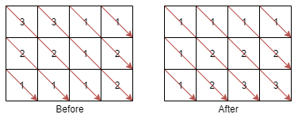

#### 题目地址
[1329. Sort the Matrix Diagonally](https://leetcode.com/problems/sort-the-matrix-diagonally/)
#### 题目描述
```
Given a m * n matrix mat of integers, sort it diagonally in ascending order from the top-left to the bottom-right then return the sorted array.


Example 1:
```

```
Input: mat = [[3,3,1,1],[2,2,1,2],[1,1,1,2]]
Output: [[1,1,1,1],[1,2,2,2],[1,2,3,3]]
 

Constraints:

    1. m == mat.length
    2. n == mat[i].length
    3. 1 <= m, n <= 100
    4. 1 <= mat[i][j] <= 100
```

##### 代码

- 解法一
```
/**
 * @param {number[][]} mat
 * @return {number[][]}
 */
var diagonalSort = function(mat) {
    
};
```
