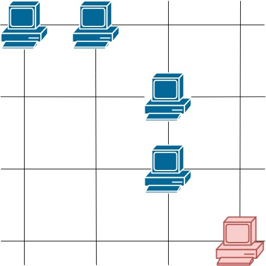

#### 题目地址
[1267. Count Servers that Communicate](https://leetcode.com/problems/count-servers-that-communicate/)
#### 题目描述
```
You are given a map of a server center, represented as a m * n integer matrix grid, where 1 means that on that cell there is a server and 0 means that it is no server. Two servers are said to communicate if they are on the same row or on the same column.

Return the number of servers that communicate with any other server.

 

Example 1:
```

```
  Input: grid = [[1,0],[0,1]]
  Output: 0
  Explanation: No servers can communicate with others.
  
Example 2:
```

```
  Input: grid = [[1,0],[1,1]]
  Output: 3
  Explanation: All three servers can communicate with at least one other server.

Example 3:
```

```
  Input: grid = [[1,1,0,0],[0,0,1,0],[0,0,1,0],[0,0,0,1]]
  Output: 4
  Explanation: The two servers in the first row can communicate with each other. The two servers in the third column can communicate with each other. The server at right bottom corner can't communicate with any other server.

Constraints:

    1. m == grid.length
    2. n == grid[i].length
    3. 1 <= m <= 250
    4. 1 <= n <= 250
    5. grid[i][j] == 0 or 1
```

##### 代码

- 解法一
```
/**
 * @param {number[][]} grid
 * @return {number}
 */
var countServers = function(grid) {
    
};
```
