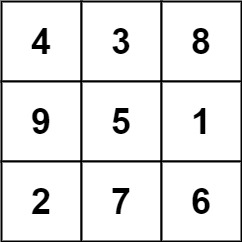
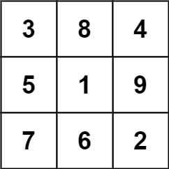

#### Problem Title
[840. Magic Squares In Grid](https://leetcode.com/problems/magic-squares-in-grid/)
#### Problem Description
```
A 3 x 3 magic square is a 3 x 3 grid filled with distinct numbers from 1 to 9 such that each row, column, and both diagonals all have the same sum.

Given a row x col grid of integers, how many 3 x 3 "magic square" subgrids are there?  (Each subgrid is contiguous).

Example 1:
```

```
    Input: grid = [[4,3,8,4],[9,5,1,9],[2,7,6,2]]
    Output: 1
    Explanation: 
      The following subgrid is a 3 x 3 magic square:
```

```
    while this one is not:
```

```
   In total, there is only one magic square inside the given grid.
Example 2:

  Input: grid = [[8]]
  Output: 0

Example 3:

  Input: grid = [[4,4],[3,3]]
  Output: 0

Example 4:

  Input: grid = [[4,7,8],[9,5,1],[2,3,6]]
  Output: 0
 

Constraints:

  1. row == grid.length
  2. col == grid[i].length
  3. 1 <= row, col <= 10
  4. 0 <= grid[i][j] <= 15
```

##### Code

- Solution One
```
/**
 * @param {number[][]} grid
 * @return {number}
 */
var numMagicSquaresInside = function(grid) {
    
};
```
