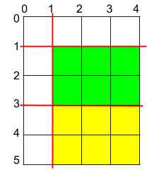

#### Problem Title
[1465. Maximum Area of a Piece of Cake After Horizontal and Vertical Cuts](https://leetcode.com/problems/maximum-area-of-a-piece-of-cake-after-horizontal-and-vertical-cuts/)
#### Problem Description
```
Given a rectangular cake with height h and width w, and two arrays of integers horizontalCuts and verticalCuts where horizontalCuts[i] is the distance from the top of the rectangular cake to the ith horizontal cut and similarly, verticalCuts[j] is the distance from the left of the rectangular cake to the jth vertical cut.

Return the maximum area of a piece of cake after you cut at each horizontal and vertical position provided in the arrays horizontalCuts and verticalCuts. Since the answer can be a huge number, return this modulo 10^9 + 7.

Example 1:
```

```
  Input: h = 5, w = 4, horizontalCuts = [1,2,4], verticalCuts = [1,3]
  Output: 4 
  Explanation: The figure above represents the given rectangular cake. Red lines are the horizontal and vertical cuts. After you cut the cake, the green piece of cake has the maximum area.

Example 2:
```

```
  Input: h = 5, w = 4, horizontalCuts = [3,1], verticalCuts = [1]
  Output: 6
  Explanation: The figure above represents the given rectangular cake. Red lines are the horizontal and vertical cuts. After you cut the cake, the green and yellow pieces of cake have the maximum area.

Example 3:

  Input: h = 5, w = 4, horizontalCuts = [3], verticalCuts = [3]
  Output: 9

Constraints:

    1. 2 <= h, w <= 10^9
    2. 1 <= horizontalCuts.length < min(h, 10^5)
    3. 1 <= verticalCuts.length < min(w, 10^5)
    4. 1 <= horizontalCuts[i] < h
    5. 1 <= verticalCuts[i] < w
    6. It is guaranteed that all elements in horizontalCuts are distinct.
    7. It is guaranteed that all elements in verticalCuts are distinct.
```

##### Code

- Solution One
```
/**
 * @param {number} h
 * @param {number} w
 * @param {number[]} horizontalCuts
 * @param {number[]} verticalCuts
 * @return {number}
 */
var maxArea = function(h, w, horizontalCuts, verticalCuts) {
    
};
```
