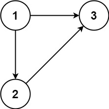

#### Problem Title
[685. Redundant Connection II](https://leetcode.com/problems/redundant-connection-ii/)
#### Problem Description
```
In this problem, a rooted tree is a directed graph such that, there is exactly one node (the root) for which all other nodes are descendants of this node, plus every node has exactly one parent, except for the root node which has no parents.

The given input is a directed graph that started as a rooted tree with n nodes (with distinct values from 1 to n), with one additional directed edge added. The added edge has two different vertices chosen from 1 to n, and was not an edge that already existed.

The resulting graph is given as a 2D-array of edges. Each element of edges is a pair [ui, vi] that represents a directed edge connecting nodes ui and vi, where ui is a parent of child vi.

Return an edge that can be removed so that the resulting graph is a rooted tree of n nodes. If there are multiple answers, return the answer that occurs last in the given 2D-array.

Example 1:
```

```
  Input: edges = [[1,2],[1,3],[2,3]]
  Output: [2,3]

Example 2:
```

```
  Input: edges = [[1,2],[2,3],[3,4],[4,1],[1,5]]
  Output: [4,1]

Constraints:

    1. n == edges.length
    2. 3 <= n <= 1000
    3. edges[i].length == 2
    4. 1 <= ui, vi <= n
```
##### Code

- Solution One
```
/**
 * @param {number[][]} edges
 * @return {number[]}
 */
var findRedundantDirectedConnection = function(edges) {
    
};
```
