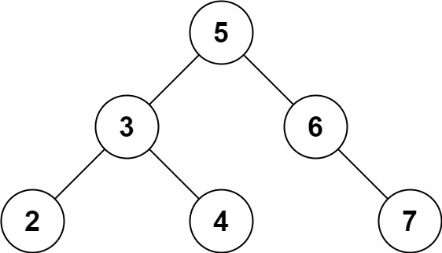

#### Problem Title
[653. Two Sum IV - Input is a BST](https://leetcode.com/problems/two-sum-iv-input-is-a-bst/)
#### Problem Description
```
Given the root of a Binary Search Tree and a target number k, return true if there exist two elements in the BST such that their sum is equal to the given target.

Example 1:
```

```
  Input: root = [5,3,6,2,4,null,7], k = 9
  Output: true

Example 2:
```

```
  Input: root = [5,3,6,2,4,null,7], k = 28
  Output: false

Example 3:

  Input: root = [2,1,3], k = 4
  Output: true

Example 4:

  Input: root = [2,1,3], k = 1
  Output: false

Example 5:

  Input: root = [2,1,3], k = 3
  Output: true

Constraints:

  1. The number of nodes in the tree is in the range [1, 10^4].
  2. -10^4 <= Node.val <= 10^4
  3. root is guaranteed to be a valid binary search tree.
  4. -10^5 <= k <= 10^5
```

##### Code

- Solution One
```
/**
 * Definition for a binary tree node.
 * function TreeNode(val, left, right) {
 *     this.val = (val===undefined ? 0 : val)
 *     this.left = (left===undefined ? null : left)
 *     this.right = (right===undefined ? null : right)
 * }
 */
/**
 * @param {TreeNode} root
 * @param {number} k
 * @return {boolean}
 */
var findTarget = function(root, k) {
    
};
```
