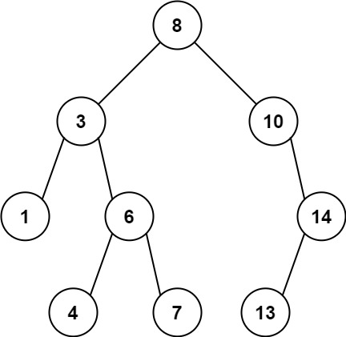

#### 题目地址
[1026. Maximum Difference Between Node and Ancestor](https://leetcode.com/problems/maximum-difference-between-node-and-ancestor/)
#### 题目描述
```
Given the root of a binary tree, find the maximum value V for which there exist different nodes A and B where V = |A.val - B.val| and A is an ancestor of B.

A node A is an ancestor of B if either: any child of A is equal to B, or any child of A is an ancestor of B.

Example 1:
```

```
  Input: root = [8,3,10,1,6,null,14,null,null,4,7,13]
  Output: 7
  Explanation: We have various ancestor-node differences, some of which are given below :
  |8 - 3| = 5
  |3 - 7| = 4
  |8 - 1| = 7
  |10 - 13| = 3
  Among all possible differences, the maximum value of 7 is obtained by |8 - 1| = 7.

Example 2:
```

```
  Input: root = [1,null,2,null,0,3]
  Output: 3

Constraints:

  1. The number of nodes in the tree is in the range [2, 5000].
  2. 0 <= Node.val <= 10^5
```
##### 代码

- 解法一
```
/**
 * Definition for a binary tree node.
 * function TreeNode(val, left, right) {
 *     this.val = (val===undefined ? 0 : val)
 *     this.left = (left===undefined ? null : left)
 *     this.right = (right===undefined ? null : right)
 * }
 */
/**
 * @param {TreeNode} root
 * @return {number}
 */
var maxAncestorDiff = function(root) {
    
};
```
