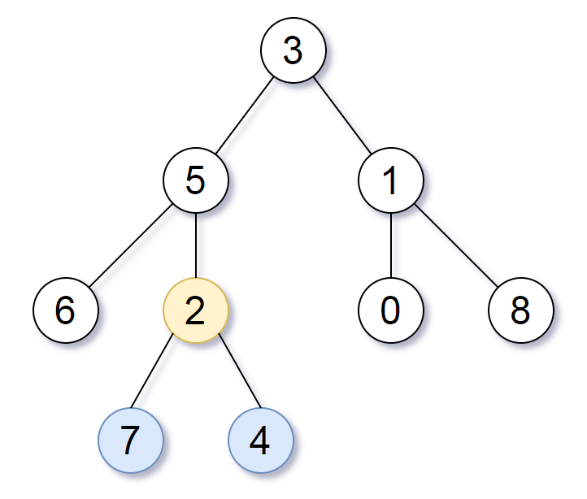

#### 题目地址
[865. Smallest Subtree with all the Deepest Nodes](https://leetcode.com/problems/smallest-subtree-with-all-the-deepest-nodes/)
#### 题目描述
```
Given the root of a binary tree, the depth of each node is the shortest distance to the root.

Return the smallest subtree such that it contains all the deepest nodes in the original tree.

A node is called the deepest if it has the largest depth possible among any node in the entire tree.

The subtree of a node is tree consisting of that node, plus the set of all descendants of that node.

Note: This question is the same as 1123: https://leetcode.com/problems/lowest-common-ancestor-of-deepest-leaves/

Example 1:
```

```
  Input: root = [3,5,1,6,2,0,8,null,null,7,4]
  Output: [2,7,4]
  Explanation: We return the node with value 2, colored in yellow in the diagram.
  The nodes coloured in blue are the deepest nodes of the tree.
  Notice that nodes 5, 3 and 2 contain the deepest nodes in the tree but node 2 is the smallest subtree among them, so we return it.

Example 2:

  Input: root = [1]
  Output: [1]
  Explanation: The root is the deepest node in the tree.

Example 3:

  Input: root = [0,1,3,null,2]
  Output: [2]
  Explanation: The deepest node in the tree is 2, the valid subtrees are the subtrees of nodes 2, 1 and 0 but the subtree of node 2 is the smallest.
 

Constraints:

  1. The number of nodes in the tree will be in the range [1, 500].
  2. 0 <= Node.val <= 500
  3. The values of the nodes in the tree are unique.
```
##### 代码

- 解法一
```
/**
 * Definition for a binary tree node.
 * function TreeNode(val, left, right) {
 *     this.val = (val===undefined ? 0 : val)
 *     this.left = (left===undefined ? null : left)
 *     this.right = (right===undefined ? null : right)
 * }
 */
/**
 * @param {TreeNode} root
 * @return {TreeNode}
 */
var subtreeWithAllDeepest = function(root) {
    
};
```
