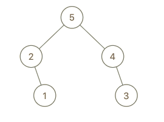

#### Problem Title
[998. Maximum Binary Tree II](https://leetcode.com/problems/maximum-binary-tree-ii/)
#### Problem Description
```
We are given the root node of a maximum tree: a tree where every node has a value greater than any other value in its subtree.

Just as in the previous problem, the given tree was constructed from an list A (root = Construct(A)) recursively with the following Construct(A) routine:

    1. If A is empty, return null.
    2. Otherwise, let A[i] be the largest element of A.  Create a root node with value A[i].
    3. The left child of root will be Construct([A[0], A[1], ..., A[i-1]])
    4. The right child of root will be Construct([A[i+1], A[i+2], ..., A[A.length - 1]])
    5. Return root.

Note that we were not given A directly, only a root node root = Construct(A).

Suppose B is a copy of A with the value val appended to it.  It is guaranteed that B has unique values.

Return Construct(B).

Example 1:
```

```
  Input: root = [4,1,3,null,null,2], val = 5
  Output: [5,4,null,1,3,null,null,2]
  Explanation: A = [1,4,2,3], B = [1,4,2,3,5]

Example 2:
```

```
  Input: root = [5,2,4,null,1], val = 3
  Output: [5,2,4,null,1,null,3]
  Explanation: A = [2,1,5,4], B = [2,1,5,4,3]

Example 3:
```

```
  Input: root = [5,2,3,null,1], val = 4
  Output: [5,2,4,null,1,3]
  Explanation: A = [2,1,5,3], B = [2,1,5,3,4]
 
Constraints:

  1. 1 <= B.length <= 100
```
##### Code

- Solution One
```
/**
 * Definition for a binary tree node.
 * function TreeNode(val, left, right) {
 *     this.val = (val===undefined ? 0 : val)
 *     this.left = (left===undefined ? null : left)
 *     this.right = (right===undefined ? null : right)
 * }
 */
/**
 * @param {TreeNode} root
 * @param {number} val
 * @return {TreeNode}
 */
var insertIntoMaxTree = function(root, val) {
    
};
```
