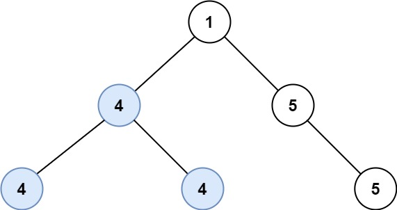

#### Problem Title
[687. Longest Univalue Path](https://leetcode.com/problems/longest-univalue-path/)
#### Problem Description
```
Given the root of a binary tree, return the length of the longest path, where each node in the path has the same value. This path may or may not pass through the root.

The length of the path between two nodes is represented by the number of edges between them.

Example 1:
```

```
  Input: root = [5,4,5,1,1,5]
  Output: 2

Example 2:
```

```
  Input: root = [1,4,5,4,4,5]
  Output: 2
 

Constraints:

  1. The number of nodes in the tree is in the range [0, 10^4].
  2. -1000 <= Node.val <= 1000
  3. The depth of the tree will not exceed 1000.
```
##### Code

- Solution One
```
/**
 * Definition for a binary tree node.
 * function TreeNode(val, left, right) {
 *     this.val = (val===undefined ? 0 : val)
 *     this.left = (left===undefined ? null : left)
 *     this.right = (right===undefined ? null : right)
 * }
 */
/**
 * @param {TreeNode} root
 * @return {number}
 */
var longestUnivaluePath = function(root) {
    
};
```
